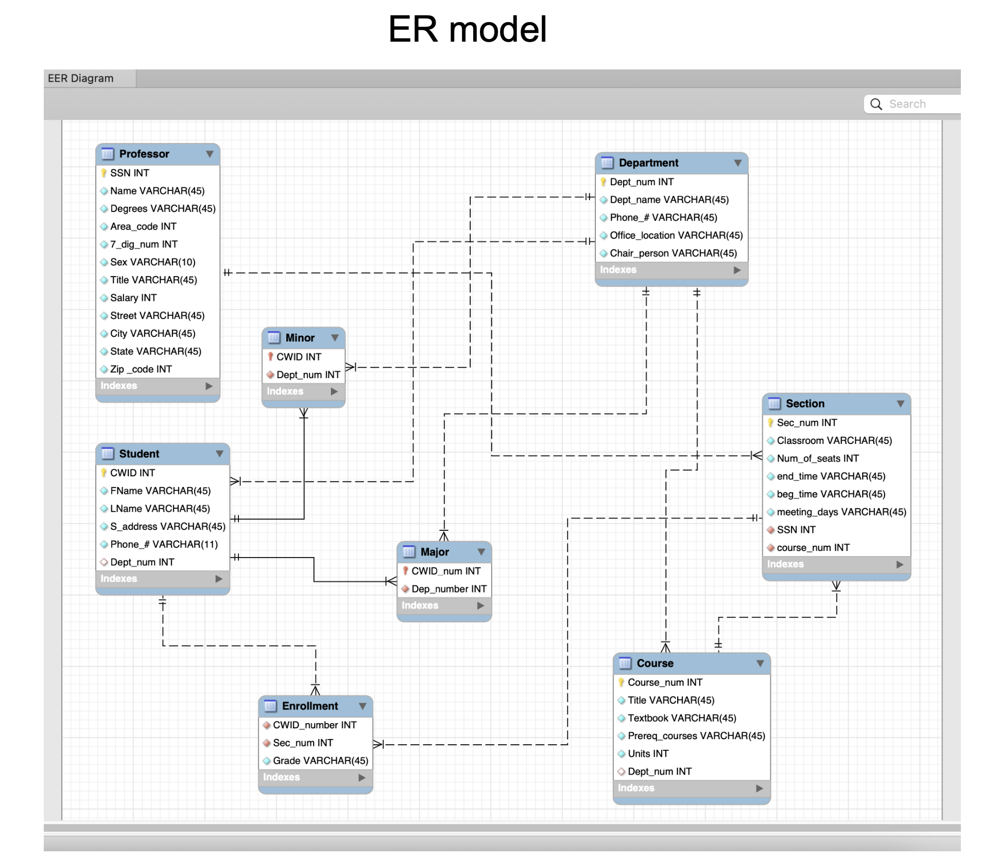
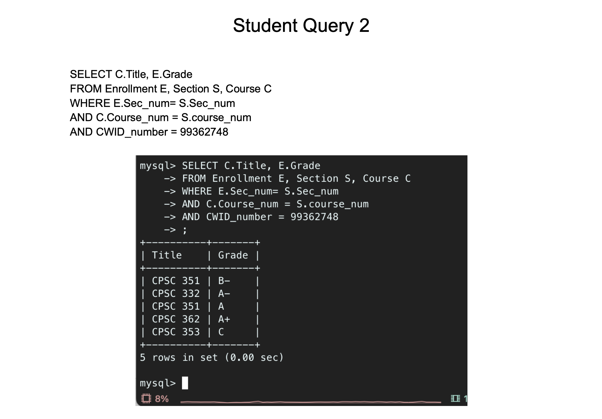
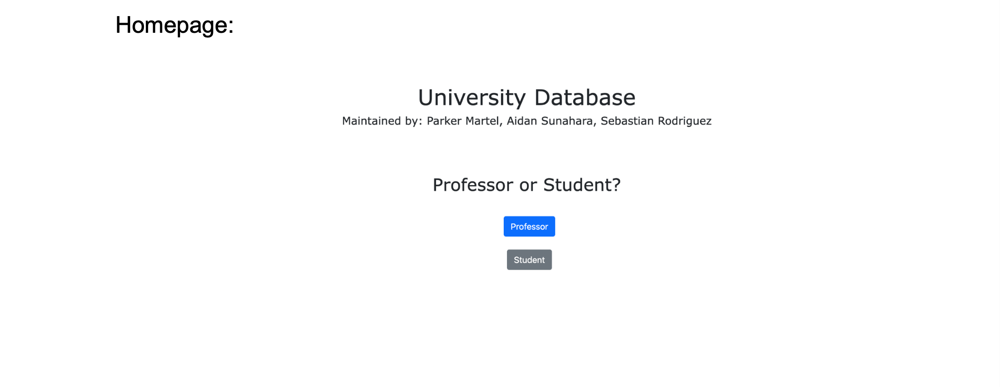

# University-Database
 Databases project to use MySQL database and PHP to build a web database application for a university. We made our database in MySQL Workbench and created an Entity Relationship diagram, a relational model with primary and foreign keys, and then implemented it on a website using HTML and CSS. The website features student and professor query pages that they can use to lookup various records in the database. The records in the database include students, courses, departments, sections, professors, and enrollment records.

